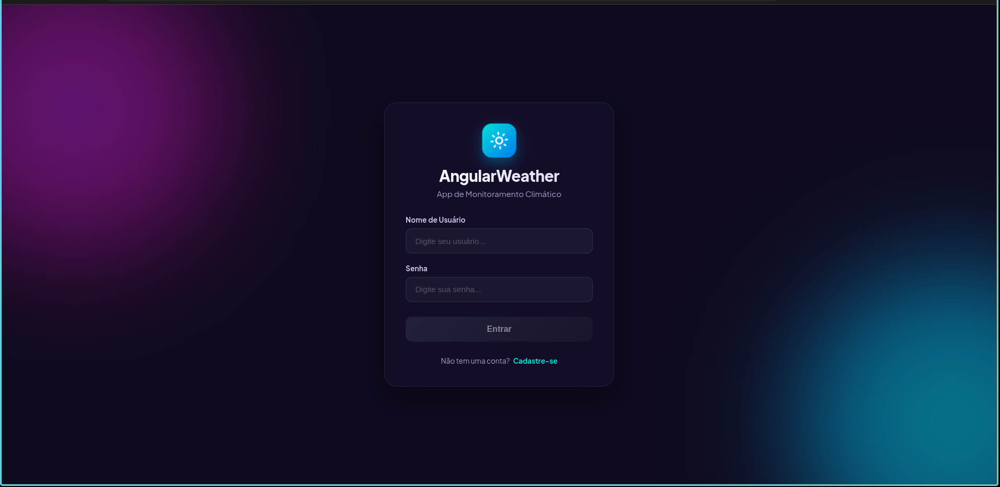
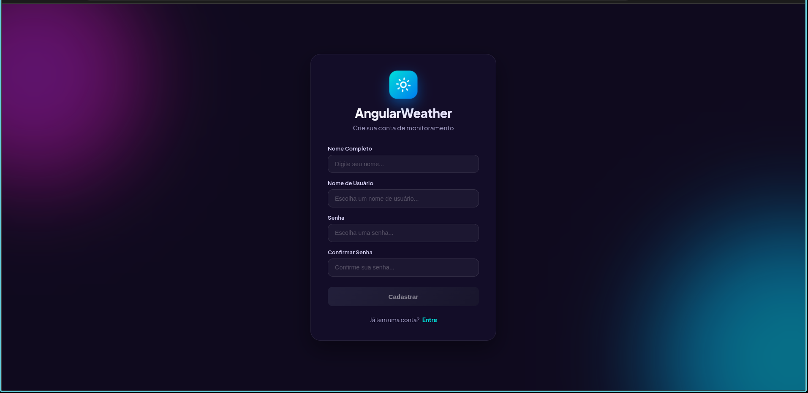
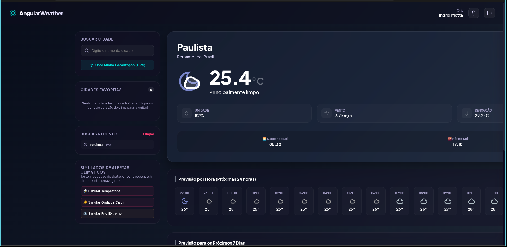
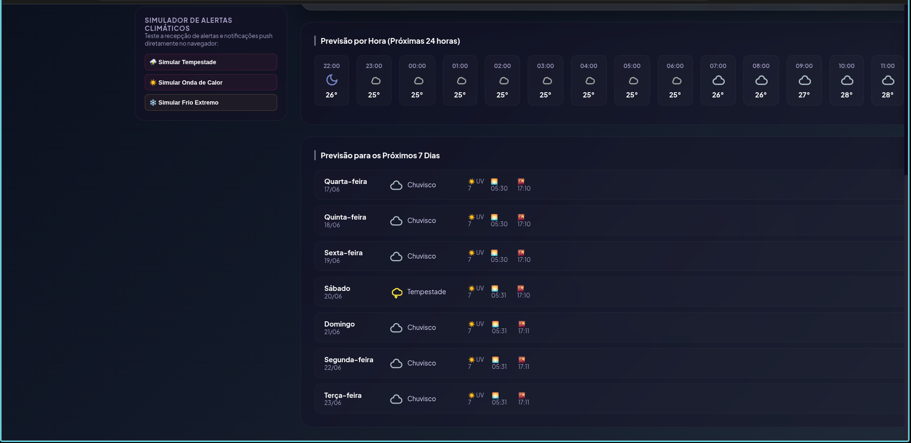

# AngularWeather

**AngularWeather** é um aplicativo web moderno, responsivo e de alta fidelidade visual para monitoramento climático em tempo real. O projeto consome dados da API pública REST do Open-Meteo, oferecendo dados meteorológicos precisos com suporte a cache offline, geolocalização e alertas de condições extremas.

---

## 📸 Capturas de Tela

Abaixo estão as principais telas desenvolvidas no sistema, utilizando um design premium baseado em glassmorfismo e gradientes dinâmicos orientados pelo clima:

### 1. Tela de Login

Interface de login minimalista e segura, protegida contra acesso não autorizado.


### 2. Tela de Cadastro

Cadastro de novos usuários com validação dinâmica de campos e confirmação de senha.


### 3. Painel Principal (Dashboard)

Painel com informações completas em tempo real, previsões de 24h e 7 dias, busca de cidades, favoritos e histórico de buscas isolado por usuário.



---

## 🛠️ Tecnologias e Dependências

- **Core**: [Angular 22](https://angular.dev/) (Componentes estruturados com standalone: false e NgModules).
- **Linguagem**: TypeScript.
- **Estilização**: CSS Vanilla com HSL/OKLCH dinâmicos e transições aceleradas por GPU.
- **REST API**: Integração com [Open-Meteo Geocoding e Forecast API](https://open-meteo.com/).
- **Geolocalização**: [Capacitor Geolocation](https://capacitorjs.com/docs/apis/geolocation) para obtenção de coordenadas de GPS com fallback automático para a API de geolocalização do navegador.
- **Notificações**: [Capacitor Push Notifications](https://capacitorjs.com/docs/apis/push-notifications) e Web Notifications API integradas.
- **Gerenciamento de Estado**: Injeção reativa do Angular e Signals.
- **Persistência**: LocalStorage estruturado para simulação de base de dados (usuários), controle de sessões (JWT), histórico de buscas e lista de favoritos.

---

## 🌟 Funcionalidades Implementadas

1. **Autenticação Segura via JWT Simulado**:

   - Sistema de cadastro e login de usuários salvando dados criptografados em base64.
   - Geração de token JWT simulado de três partes (header, payload e assinatura) com tempo de expiração de 2 horas.
   - Guarda de rota (`AuthGuard`) impedindo acesso ao painel por usuários não autenticados.
   - Isolamento completo de dados (favoritos, buscas recentes e cache) por usuário logado.
2. **Integração com API REST de Clima**:

   - Integração com a API pública do Open-Meteo, que dispensa chaves de API, garantindo robustez na entrega.
   - Mapeamento completo dos códigos WMO de clima (temperatura, umidade, vento, pressão, índice UV, nascer e pôr do sol).
   - Renderização dinâmica de ícones SVG estilizados e responsivos para cada tipo de clima.
   - Mudança dinâmica dos gradientes de fundo do dashboard baseada na condição climática atual da cidade consultada.
3. **Previsão por Dia e Hora**:

   - **Previsão Horária**: Slider horizontal com as próximas 24 horas detalhadas (hora, ícone e temperatura).
   - **Previsão Diária**: Lista estruturada para os próximos 7 dias (dia, data, ícone, condição, índice UV, nascer/pôr do sol e temperatura mínima/máxima com barra de gradiente térmico).
4. **Favoritos e Histórico de Pesquisa**:

   - Permite adicionar ou remover a cidade atualmente visualizada dos favoritos com o clique de um botão reativo.
   - Mantém as 10 últimas buscas recentes para acesso rápido.
   - Persistência e isolamento completo no LocalStorage por conta de usuário.
5. **Localização Atual via GPS**:

   - Botão para buscar as coordenadas geográficas do usuário instantaneamente e exibir o clima local de forma transparente.
6. **Notificações Push e Simulador de Alertas**:

   - Varredura de condições extremas para disparar notificações em tempo real (ex: calor extremo >35°C, frio <5°C ou tempestades).
   - **Simulador Integrado**: Painel especial que permite testar alertas de tempestades e ondas de calor/frio instantaneamente no navegador para verificar a usabilidade e recepção das notificações.
7. **Suporte Offline e Cache Resiliente**:

   - Cada consulta bem-sucedida é gravada localmente.
   - Caso a rede falhe ou o usuário esteja sem internet, o sistema carrega o cache local e exibe um badge visual informativo: `"Offline (Atualizado: DD/MM/AAAA às HH:MM)"`.

---

## ⚙️ Configuração e Execução

### Pré-requisitos

- Node.js instalado (versão LTS recomendada).
- Angular CLI instalado globalmente (`npm install -g @angular/cli`).

### Instalação

1. Clone este repositório:
   ```bash
   git clone https://github.com/GabrielCaricchio/AngularWeather.git
   ```
2. Navegue até a pasta do projeto:
   ```bash
   cd AngularWeather/AngularWeather
   ```
3. Instale as dependências:
   ```bash
   npm install
   ```

### Executar Servidor Local

Para rodar a aplicação em modo de desenvolvimento:

```bash
npm run start
```

Após compilar, abra o navegador em `http://localhost:4200/`.

### Compilar para Produção

Para gerar o pacote de produção da aplicação:

```bash
npm run build
```

Os arquivos otimizados serão criados no diretório `dist/AngularWeather`.

### Executar Testes Unitários

Para rodar a suíte de testes unitários com o Vitest:

```bash
npm run test
```

---

## 📄 Licença

Este projeto está sob a licença MIT. Consulte o arquivo [LICENSE](LICENSE) para obter mais detalhes.
